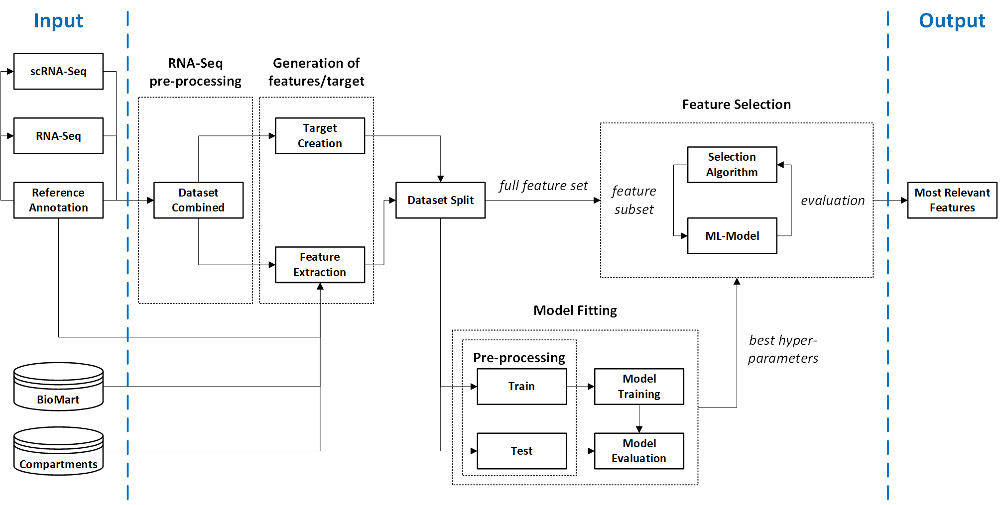

# FAVSeq
## Machine learning-based pipeline for identification of factors contributing to the technical variability between bulk and single-cell RNA-seq experiments

This repository contains implementation of the **FAVSeq** pipeline presented in the paper 
[bioRxiv:10.1101/2022.01.06.474932](https://doi.org/10.1101/2022.01.06.474932) (under review).

## Summary

Recent studies in the area of transcriptomics performed on single-cell and population levels reveal noticeable 
variability in gene expression measurements provided by different RNA sequencing technologies. Due to increased noise 
and complexity of single-cell RNA-Seq (scRNA-Seq) data over the bulk experiment, there is a substantial number of 
variably-expressed genes and so-called dropouts, challenging the subsequent computational analysis and potentially 
leading to false positive discoveries. In order to investigate factors affecting technical variability between RNA 
sequencing experiments of different technologies, we performed a systematic assessment of single-cell and bulk RNA-Seq 
data, which have undergone the same pre-processing and sample preparation procedures.

In order to identify which factors determine whether genes are differently detected in matched RNA-Seq experiments, we 
propose **FAVSeq** (**F**actors **A**ffecting **V**ariability in **Seq**uencing data), a machine learning-assisted 
pipeline for analyzing multimodal RNA-Seq data, those design intends to support researchers in disclosing potential 
root causes of the quantitative and dropouts-associated differences observed between RNA-Seq technologies.
**FAVSeq** enables to select features obtaining the strongest predictive power for estimation of technical variability 
between RNA sequencing modalities.

## Workflow

Framework utilized in the **FAVSeq** pipeline for ranking and selection of features
affecting the technical variability in RNA-Seq datasets of matched experiments consists of the following steps:


1. Creation of the target difference by calculating OLS residuals in gene expression levels.
2. Generation of gene-associated features based on GTF annotation and open-access databases.
3. Optionally, imputation of missing values in features (e.g., using k-NN method).
4. Model training and hyper-parameters optimization through the 5-fold CV grid-search.
5. Feature importance assessment based on the RFE approach.
6. Output the summary reports as CSV tables and visuals.




## Usage

In order identify factors affecting gene expression variability in your data, consider using **FAVSeq** as follows.

### Prerequisites
Before running the code, please ensure that you use Python >= 3.8.

### Step 1: Clone the repository
[Clone](https://docs.github.com/en/repositories/creating-and-managing-repositories/cloning-a-repository) this repository to your local machine.

### Step 2: Configure workflow
Adjust [JSON-configuration file](protocols.json) according to your needs.

### Step 3: Run FAVSeq pipeline
The experiment is to be run from the command line, the estimated feature importance scores depend on the input data and on the actual prediction task.

##### Gene expression difference (regression task)
``` Bash
python -m favseq.run -i </path/to/data.csv> -o results -t regression
```

##### Dropout events (classification task)
``` Bash
python -m favseq.run -i </path/to/data.csv> -o results -t classification -n knn
```
Here, as the presence of NaN-values assumed, those values are to be imputed using k-Nearest Neighbor approach.
